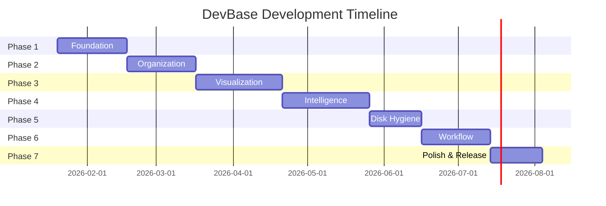

# DevBase - Technical Specification Document

> **Version:** 1.0  
> **Status:** Draft  
> **Date:** January 19, 2026

---

## Executive Summary

**DevBase** is a lightning-fast, offline-first desktop application serving as the central nervous system for managing every Git repository on a developer's machine. It provides repository discovery, health monitoring, deep visualization, global code search, and disk hygiene tools.

---

## Technology Stack

| Layer | Technology | Rationale |
|-------|------------|-----------|
| **Core Runtime** | Tauri (Rust) | Native performance, low memory, secure file system access |
| **Frontend** | React + TypeScript | Component-based UI, rich ecosystem, type safety |
| **Git Engine** | `git2-rs` (libgit2) | Programmatic Git access without shell parsing |
| **Search Engine** | `ripgrep` (Rust) | Blazing fast regex-capable code search |
| **Database** | SQLite (via `rusqlite`) | Local persistence for tags, settings, analytics |
| **File Watcher** | `notify` (Rust crate) | Real-time file system monitoring |

---

## Development Phases

### Phase 1: Foundation & Core Infrastructure ✅ COMPLETE
**Duration:** 3-4 weeks  
**Goal:** Establish project skeleton, core Rust backend, and basic React frontend shell.
**Status:** ✅ Completed January 19, 2026

#### Deliverables
| ID | Feature | Description | Status |
|----|---------|-------------|--------|
| 1.1 | Project Scaffolding | Initialize Tauri + React + TypeScript project structure | ✅ |
| 1.2 | Rust Backend Shell | Core Tauri commands, IPC bridge, error handling | ✅ |
| 1.3 | SQLite Integration | Database schema, migrations, CRUD operations | ✅ |
| 1.4 | Frontend Shell | React app shell, routing, global state (Zustand) | ✅ |
| 1.5 | Build Pipeline | Dev/Prod builds, linting setup | ✅ |

#### Tests - Phase 1
| Test ID | Type | Description | Command/Method | Status |
|---------|------|-------------|----------------|--------|
| T1.1 | Unit | Rust error handling serialization | `cargo test error` | ✅ |
| T1.2 | Unit | SQLite schema initialization | `cargo test db::tests` | ✅ |
| T1.3 | Unit | Health check commands | `cargo test commands::tests` | ✅ |
| T1.4 | Integration | Tauri IPC communication | `npm run tauri dev` | ✅ |
| T1.5 | Unit | Database tables & settings | `cargo test db::tests` | ✅ |

---

### Phase 2: Module A - Organization & Discovery ✅ COMPLETE
**Duration:** 3-4 weeks  
**Goal:** Repository auto-discovery, file watching, smart grouping, and health dashboard.
**Status:** ✅ Completed January 19, 2026

#### Deliverables
| ID | Feature | Description | Status |
|----|---------|-------------|--------|
| 2.1 | Path Configuration | User-defined scan paths (e.g., `~/Projects`) | ✅ |
| 2.2 | Recursive Scanner | Find all `.git` directories within configured paths | ✅ |
| 2.3 | File System Watcher | Real-time detection of new/deleted repositories | ⏳ Deferred |
| 2.4 | Manual Tags | User-assignable tags ("Work", "Side Projects", etc.) | ✅ |
| 2.5 | Auto-Grouping | Group by language, organization, or remote host | ⏳ Deferred |
| 2.6 | Health Dashboard | Grid view with status indicators (dirty, push/pull needed, stashed) | ✅ |

#### Tests - Phase 2
| Test ID | Type | Description | Command/Method | Status |
|---------|------|-------------|----------------|--------|
| T2.1 | Unit | Scanner finds `.git` directories | `cargo test scanner::` | ✅ |
| T2.2 | Unit | Scanner ignores nested `.git` in submodules | `cargo test scanner::` | ✅ |
| T2.3 | Unit | Git status extraction | `cargo test git::` | ✅ |
| T2.4 | Unit | Tag CRUD operations | `cargo test` | ✅ |
| T2.5 | Unit | Database operations | `cargo test db::` | ✅ |

---

### Phase 3: Module B - Deep-Dive Visualization
**Duration:** 4-5 weeks  
**Goal:** Visual commit graph, code viewer with syntax highlighting, diff engine.

#### Deliverables
| ID | Feature | Description |
|----|---------|-------------|
| 3.1 | Commit Graph | "Subway map" style branch/merge visualization |
| 3.2 | Syntax Highlighter | Support 100+ languages via `syntect` or tree-sitter |
| 3.3 | Markdown Preview | Render README.md with full GFM support |
| 3.4 | Time-Travel Viewer | View file at any commit without checkout |
| 3.5 | Diff Engine - Text | Split/unified views, line-by-line comparison |
| 3.6 | Diff Engine - Images | Swipe/onion-skin comparison for assets |
| 3.7 | Blame/Annotate | Gutter view showing author/date per line |

#### Tests - Phase 3
| Test ID | Type | Description | Command/Method |
|---------|------|-------------|----------------|
| T3.1 | Unit | Commit graph topology calculation | `cargo test graph::` |
| T3.2 | Visual | Graph renders correctly for complex histories | Manual verification with known repos |
| T3.3 | Unit | Syntax highlighting token generation | `cargo test syntax::highlight` |
| T3.4 | Unit | Markdown to HTML conversion | `cargo test markdown::render` |
| T3.5 | Integration | Time-travel returns correct file content | `cargo test time_travel::` |
| T3.6 | Unit | Diff generation (text) | `cargo test diff::text` |
| T3.7 | Unit | Diff generation (binary/image) | `cargo test diff::binary` |
| T3.8 | E2E | Blame view displays correctly | Playwright visual test |

---

### Phase 4: Module C - Intelligence Layer
**Duration:** 4-5 weeks  
**Goal:** Global code search, TODO aggregator, local analytics.

#### Deliverables
| ID | Feature | Description |
|----|---------|-------------|
| 4.1 | Global Grep | Search across ALL local repos simultaneously |
| 4.2 | Regex Support | Full regex pattern matching in search |
| 4.3 | File Type Filtering | Limit search to specific extensions |
| 4.4 | TODO Aggregator | Scan for TODO/FIXME/HACK comments globally |
| 4.5 | Contribution Heatmap | GitHub-style activity graph from local commits |
| 4.6 | Language Analytics | Breakdown of code by language across all repos |

#### Tests - Phase 4
| Test ID | Type | Description | Command/Method |
|---------|------|-------------|----------------|
| T4.1 | Unit | Ripgrep integration search | `cargo test search::grep` |
| T4.2 | Unit | Regex pattern validation | `cargo test search::regex_validate` |
| T4.3 | Unit | File type filter parsing | `cargo test search::filter` |
| T4.4 | Unit | TODO comment extraction | `cargo test aggregator::todos` |
| T4.5 | Unit | Heatmap date aggregation | `cargo test analytics::heatmap` |
| T4.6 | Unit | Language line counting | `cargo test analytics::languages` |
| T4.7 | Performance | Search 10 repos under 2 seconds | Benchmark test |

---

### Phase 5: Module D - Disk Hygiene
**Duration:** 2-3 weeks  
**Goal:** Zombie detection, branch cleanup, size analysis.

#### Deliverables
| ID | Feature | Description |
|----|---------|-------------|
| 5.1 | Zombie Detection | Find repos inactive >6 months |
| 5.2 | Archive Function | Zip and optionally delete zombie repos |
| 5.3 | Branch Sweeper | One-click cleanup of merged branches |
| 5.4 | Size Analyzer | Treemap visualization of repo sizes |
| 5.5 | Bloat Detector | Alert for oversized `.git` folders |

#### Tests - Phase 5
| Test ID | Type | Description | Command/Method |
|---------|------|-------------|----------------|
| T5.1 | Unit | Zombie detection with 6-month threshold | `cargo test hygiene::zombie` |
| T5.2 | Integration | Archive creates valid zip | `cargo test hygiene::archive` |
| T5.3 | Unit | Merged branch detection | `cargo test hygiene::merged_branches` |
| T5.4 | Unit | Size calculation accuracy | `cargo test hygiene::size` |
| T5.5 | Unit | Bloat threshold detection | `cargo test hygiene::bloat` |

---

### Phase 6: Module E - Workflow Integration
**Duration:** 3-4 weeks  
**Goal:** Script runner, container control, pre-flight safety checks.

#### Deliverables
| ID | Feature | Description |
|----|---------|-------------|
| 6.1 | Script Detection | Parse package.json, Makefile, Cargo.toml |
| 6.2 | Script Runner | Execute detected scripts from UI |
| 6.3 | Container Control | Start/stop docker-compose services |
| 6.4 | Secret Scanner | Detect API keys before push |
| 6.5 | Identity Guard | Warn on email mismatch in work repos |

#### Tests - Phase 6
| Test ID | Type | Description | Command/Method |
|---------|------|-------------|----------------|
| T6.1 | Unit | package.json script parsing | `cargo test workflow::npm_scripts` |
| T6.2 | Unit | Makefile target parsing | `cargo test workflow::make_targets` |
| T6.3 | Integration | Script execution with output capture | Manual test with mock scripts |
| T6.4 | Unit | Secret pattern detection | `cargo test safety::secrets` |
| T6.5 | Unit | Email identity validation | `cargo test safety::identity` |
| T6.6 | Integration | Docker compose detection | `cargo test workflow::docker` |

---

### Phase 7: Polish & Release
**Duration:** 2-3 weeks  
**Goal:** Performance optimization, UX polish, installer creation, documentation.

#### Deliverables
| ID | Feature | Description |
|----|---------|-------------|
| 7.1 | Performance Audit | Memory profiling, startup time optimization |
| 7.2 | UI/UX Polish | Animations, keyboard shortcuts, accessibility |
| 7.3 | Installer Creation | .deb, .rpm, .dmg, .msi packages |
| 7.4 | Auto-Updater | In-app update mechanism |
| 7.5 | User Documentation | Help docs, onboarding flow |

#### Tests - Phase 7
| Test ID | Type | Description | Command/Method |
|---------|------|-------------|----------------|
| T7.1 | Performance | App starts in <2 seconds | Benchmark measurement |
| T7.2 | Performance | Memory usage <150MB idle | System monitor check |
| T7.3 | Accessibility | Screen reader compatibility | Manual + axe-core audit |
| T7.4 | E2E | Full user flow test | Playwright end-to-end suite |
| T7.5 | Installation | Installer works on each platform | VM testing per OS |

---

## Test Strategy Overview

### Test Pyramid
```
       /\
      /  \     E2E (Playwright/Cypress)
     /----\    
    /      \   Integration Tests
   /--------\  
  /          \ Unit Tests (cargo test, jest)
 /____________\
```

### Continuous Integration
- **Pre-commit:** Linting (clippy, eslint), formatting (rustfmt, prettier)
- **PR Checks:** Full unit + integration test suite
- **Nightly:** E2E tests, performance benchmarks
- **Release:** Full regression + installer validation

### Test Coverage Goals
| Component | Target Coverage |
|-----------|-----------------|
| Rust Backend | ≥80% |
| React Frontend | ≥70% |
| Integration | All critical paths |

---

## Success Criteria

| Metric | Target |
|--------|--------|
| App Startup Time | <2 seconds |
| Memory Usage (idle) | <150 MB |
| Repo Scan (100 repos) | <5 seconds |
| Global Search (10 repos) | <2 seconds |
| Crash-free Sessions | >99.5% |

---

## Risk Mitigation

| Risk | Mitigation |
|------|------------|
| Large repo performance | Incremental loading, caching |
| Cross-platform issues | Early testing on all 3 platforms |
| Git edge cases | Comprehensive libgit2 error handling |
| Scope creep | MVP-first approach per phase |

---

## Appendix: Milestone Timeline



**Total Estimated Duration:** ~26-28 weeks
