# DevBase - Project Idea Document

> **Codename:** Code Mission Control  
> **Version:** 1.0  
> **Date:** January 19, 2026

---

## The Vision

**DevBase** is a desktop application that transforms how developers interact with their local repositories. It's not just another Git client—it's a **complete command center** for code organization, discovery, and maintenance.

---

## The Problem

Modern developers face a growing crisis of **code sprawl**:

| Pain Point | Impact |
|------------|--------|
| **Lost Projects** | "I know I built something similar... but where?" |
| **Forgotten Work** | Uncommitted changes sitting in repos for months |
| **Branch Chaos** | Dozens of stale branches cluttering every project |
| **Disk Bloat** | GBs of abandoned clones eating storage |
| **Context Switching** | No unified view across all projects |

> 💡 **Key Insight:** Git clients focus on *individual* repositories. DevBase focuses on your *entire local codebase*.

---

## The Solution

### Core Philosophy

```
Traditional Git Client          DevBase
       📁                    🌐
    [One Repo]            [All Repos]
        ↓                     ↓
   Commit/Push            Discover
                          Monitor
                          Search
                          Clean
                          Analyze
```

### Feature Modules

#### 🔍 Module A: Organization & Discovery
> *"Where is my code?"*

- **Auto-Discovery:** Scans configured paths for all Git repositories
- **Real-time Watcher:** Instantly detects new/deleted repos
- **Smart Grouping:** Organize by tags, language, or organization
- **Health Dashboard:** At-a-glance status of every repo

#### 📊 Module B: Deep-Dive Visualization
> *"What happened in this code?"*

- **Visual Commit Graph:** Beautiful "subway map" branch visualization
- **Mini-IDE Viewer:** Syntax highlighting for 100+ languages
- **Time-Travel:** View any file at any point in history
- **Diff Engine:** Side-by-side comparison with image diff support

#### 🧠 Module C: Intelligence Layer
> *"Help me understand my codebase"*

- **Global Code Search:** Find strings across ALL repos instantly
- **TODO Aggregator:** Master list of all TODOs, FIXMEs, HACKs
- **Local Analytics:** Your personal "GitHub Wrapped"—commit heatmaps, language stats

#### 🧹 Module D: Disk Hygiene
> *"Clean up my mess"*

- **Zombie Detection:** Find forgotten repos (>6 months inactive)
- **Branch Sweeper:** One-click cleanup of merged branches
- **Size Analyzer:** Visual treemap of disk usage per repo

#### ⚡ Module E: Workflow Integration
> *"Let me get to work"*

- **Script Runner:** Detect and run npm/cargo/make scripts
- **Container Control:** Start/stop Docker Compose services
- **Pre-Flight Safety:** Scan for secrets and email mismatches before push

---

## Target Users

### Primary Persona: "The Multi-Project Developer"

> *Sarah has 50+ repositories across work projects, side hustles, and open source contributions. She frequently forgets where code lives and has 5 GB of repos she hasn't touched in years.*

**Needs:**
- Unified view across all projects
- Quick search for past implementations
- Automated cleanup suggestions

### Secondary Persona: "The Team Lead"

> *Marcus manages a team that works across 20 microservices. He needs to track which repos have uncommitted changes or pending pushes.*

**Needs:**
- Dashboard view of work-in-progress
- Quick identification of stale branches
- Easy navigation to any service

---

## Competitive Landscape

| Feature | GitHub Desktop | GitKraken | Sourcetree | **DevBase** |
|---------|----------------|-----------|------------|-------------|
| Multi-repo Dashboard | ❌ | ⚠️ Limited | ❌ | ✅ |
| Auto-discovery | ❌ | ❌ | ❌ | ✅ |
| Global Code Search | ❌ | ❌ | ❌ | ✅ |
| TODO Aggregation | ❌ | ❌ | ❌ | ✅ |
| Disk Hygiene Tools | ❌ | ❌ | ❌ | ✅ |
| Offline-first | ✅ | ⚠️ | ✅ | ✅ |
| Native Performance | ❌ Electron | ❌ Electron | ❌ | ✅ Tauri/Rust |

---

## Technical Architecture

```
┌─────────────────────────────────────────────────┐
│                  React Frontend                 │
│  ┌──────────┐ ┌──────────┐ ┌──────────────────┐│
│  │Dashboard │ │ Viewer   │ │     Search       ││
│  └──────────┘ └──────────┘ └──────────────────┘│
└─────────────────────┬───────────────────────────┘
                      │ IPC (Tauri Commands)
┌─────────────────────┴───────────────────────────┐
│                   Rust Backend                  │
│  ┌───────────┐ ┌───────────┐ ┌───────────────┐ │
│  │  Scanner  │ │  git2-rs  │ │   ripgrep     │ │
│  └───────────┘ └───────────┘ └───────────────┘ │
│  ┌───────────┐ ┌───────────┐ ┌───────────────┐ │
│  │  Watcher  │ │  SQLite   │ │   Analytics   │ │
│  └───────────┘ └───────────┘ └───────────────┘ │
└─────────────────────────────────────────────────┘
                      │
┌─────────────────────┴───────────────────────────┐
│              File System / Git Repos            │
└─────────────────────────────────────────────────┘
```

---

## Unique Value Propositions

### 1. **"Global Grep" - Search Everything**
Find that one function you wrote 2 years ago, instantly.

### 2. **"Health at a Glance"**
Know immediately which repos need attention—uncommitted work, pending pushes, stale branches.

### 3. **"Native Speed"**
Built with Tauri/Rust for 10x less memory than Electron apps and instant startup.

### 4. **"Your Code, Quantified"**
Local analytics show your actual coding patterns—not just what's pushed to GitHub.

### 5. **"Disk Diet"**
Reclaim gigabytes by identifying and archiving forgotten repositories.

---

## User Journey

```mermaid
flowchart LR
    A[🌅 Morning] --> B[Open DevBase]
    B --> C[Check Health Dashboard]
    C --> D{Uncommitted Work?}
    D -->|Yes| E[Resume yesterday's work]
    D -->|No| F[Check TODO Aggregator]
    F --> G[Pick a task]
    G --> H[Global Search for reference]
    H --> I[Open in VS Code]
    I --> J[Code!]
    J --> K[Weekly: Run Branch Sweeper]
    K --> L[Monthly: Review Zombie Repos]
```



---

## Success Metrics

| Metric | Target | Measurement |
|--------|--------|-------------|
| Daily Active Users | 1,000+ | Analytics |
| Repo Scan Performance | <5s for 100 repos | Benchmarks |
| User Retention (30-day) | >60% | Analytics |
| App Store Rating | >4.5 stars | User reviews |
| Memory Usage | <150MB idle | Profiling |

---

## Monetization Strategy

### Phase 1: Free & Open Source
- Build community, gather feedback
- Establish trust and brand recognition

### Phase 2: Premium Features (Optional)
- Cloud sync of tags/settings
- Team dashboards
- Advanced analytics

---

## Risks & Mitigations

| Risk | Likelihood | Impact | Mitigation |
|------|------------|--------|------------|
| Performance with 500+ repos | Medium | High | Incremental loading, smart caching |
| Cross-platform bugs | Medium | Medium | Early testing on all platforms |
| Feature creep | High | Medium | Strict MVP per phase |
| Libgit2 edge cases | Medium | Low | Comprehensive error handling |

---

## Roadmap Summary

| Quarter | Focus | Key Deliverable |
|---------|-------|-----------------|
| Q1 2026 | Foundation | Scanner + Health Dashboard |
| Q2 2026 | Visualization | Commit Graph + Viewer |
| Q3 2026 | Intelligence | Global Search + Analytics |
| Q4 2026 | Polish | Public Beta Release |

---

## Why This Will Succeed

1. **Real Problem:** Every developer with multiple projects feels this pain
2. **No Direct Competitor:** Existing tools focus on single-repo workflows
3. **Technical Moat:** Rust/Tauri provides significant performance advantage
4. **Clear MVP:** Scanner + Dashboard alone provides immediate value
5. **Expandable Platform:** Each module adds compounding value

---

> **"DevBase isn't trying to replace your Git client—it's the layer above it, giving you superpowers across your entire codebase."**
